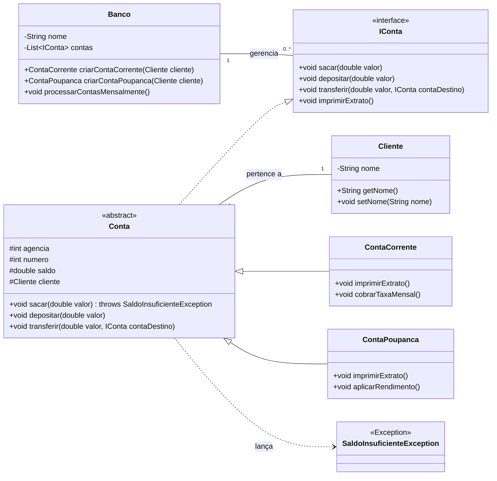

# Banco Digital com Java e Orientação a Objetos

Este projeto é uma implementação prática dos conceitos de Programação Orientada a Objetos (POO) em Java, no contexto de um banco digital. O objetivo é reforçar os pilares da POO: abstração, encapsulamento, herança e polimorfismo.

## Arquitetura e Melhorias

A versão inicial foi refatorada para aplicar princípios de design mais robustos:

1. **Validação e Exceções**: O método `sacar()` agora valida se o saldo é suficiente, lançando uma `SaldoInsuficienteException` customizada caso não seja. Isso garante a integridade do estado dos objetos `Conta`.
2. **Polimorfismo e Comportamentos Específicos**:
    - `ContaCorrente` agora possui um método `cobrarTaxaMensal()`.
    - `ContaPoupanca` possui um método `aplicarRendimento()`.
3. **Centralização de Responsabilidades (Factory e Facade)**: A classe `Banco` agora atua como uma fábrica para a criação de contas (`criarContaCorrente`, `criarContaPoupanca`), garantindo que nenhuma conta seja criada sem estar associada ao banco. Ela também centraliza a lógica de negócio que afeta múltiplas contas, como o método `processarContasMensalmente()`.

## Diagrama UML

O diagrama abaixo ilustra a nova arquitetura do projeto:



## Lombok

O projeto utiliza a biblioteca **Lombok** para reduzir o código boilerplate (métodos `getters`, `setters`, etc.), com o uso das anotações `@Getter` e `@Setter`.

## Como Executar

1. **Pré-requisito**: Para que o VS Code reconheça os métodos gerados pelo Lombok, certifique-se de que a extensão "Lombok Annotations Support for Java" da Microsoft esteja instalada.
2. Abra o terminal na **raiz do projeto `BancoDigitalOO`**.
3. Compile todos os arquivos `.java`, instruindo o compilador a usar o Lombok como processador de anotações:

    ```bash
    javac -cp "lib/lombok.jar" -processorpath "lib/lombok.jar" -d bin src/*.java
    ```

4. Execute a classe `Main`, informando ao Java para procurar as classes na pasta `bin`:

    ```bash
    java -Dfile.encoding=UTF-8 -cp "bin" Main
    ```

    *O comando `-Dfile.encoding=UTF-8` garante a exibição correta de caracteres especiais.*
