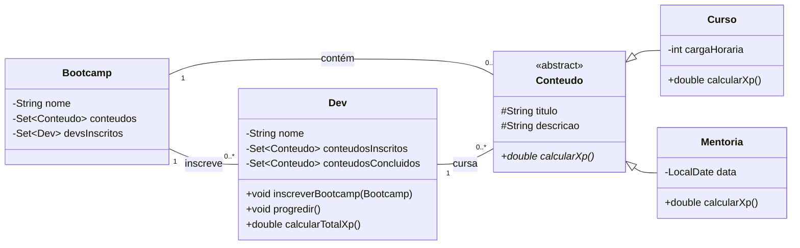

# Desafio de POO - Abstraindo um Bootcamp

Este projeto é uma implementação do desafio de Programação Orientada a Objetos da DIO, que consiste em abstrair e modelar um Bootcamp.

## Arquitetura

O projeto foi modelado com as seguintes classes para representar o domínio do problema:

- **`Conteudo`**: Uma classe abstrata que serve como base para todos os conteúdos do bootcamp (Cursos e Mentorias).
- **`Curso`**: Herda de `Conteudo` e representa um curso, com uma carga horária específica.
- **`Mentoria`**: Herda de `Conteudo` e representa uma mentoria, com uma data específica.
- **`Bootcamp`**: A classe central que agrega os conteúdos e gerencia os desenvolvedores inscritos.
- **`Dev`**: Representa um desenvolvedor, que pode se inscrever em bootcamps, progredir nos conteúdos e calcular seu XP.

## Diagrama UML



## Como Executar

1. Abra o terminal na **raiz do projeto `BootcampPOO`**.
2. Compile todos os arquivos `.java`:

    ```bash
    javac -d bin src/*.java
    ```

3. Execute a classe `Main`:

    ```bash
    java -cp bin Main
    ```

## Resultado Esperado

A execução do programa irá simular a inscrição de dois desenvolvedores, "Gustavo" e "Aline", em um bootcamp. Em seguida, simulará o progresso deles através dos conteúdos e imprimirá no console os conteúdos restantes, os concluídos e o XP total de cada um.
