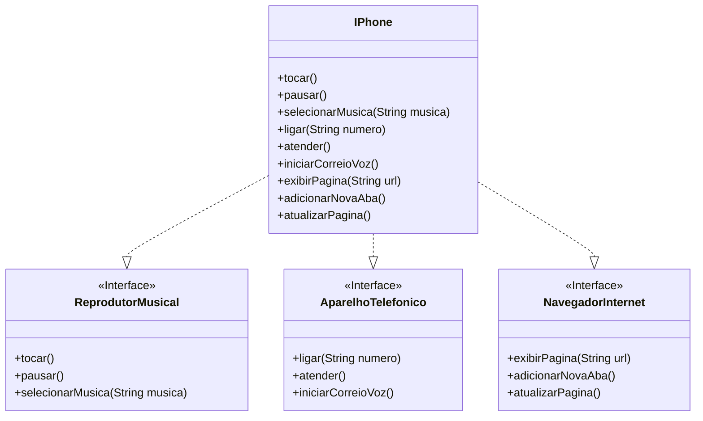

# Desafio de Modelagem de POO - iPhone

Este projeto foi desenvolvido como parte do desafio de Programação Orientada a Objetos da trilha de Java Básico da DIO. O objetivo era modelar e implementar as funcionalidades de um iPhone, com base no seu vídeo de lançamento de 2007.

## Modelagem UML

A modelagem foi baseada no conceito de interfaces para representar os diferentes papéis que o aparelho desempenha: Reprodutor Musical, Aparelho Telefônico e Navegador na Internet. A classe `IPhone` então implementa essas três interfaces, centralizando todas as funcionalidades.

Abaixo, o diagrama UML representando a estrutura:



## Estrutura do Código

- **Interfaces**:
  - `ReprodutorMusical.java`: Define o contrato para as funções de música.
  - `AparelhoTelefonico.java`: Define o contrato para as funções de telefonia.
  - `NavegadorInternet.java`: Define o contrato para as funções de navegação web.
- **Classe Concreta**:
  - `IPhone.java`: Implementa as três interfaces, fornecendo o corpo para cada método.
- **Classe de Demonstração**:
  - `MeuIPhone.java`: Contém o método `main` para instanciar e testar as funcionalidades do `IPhone`.

## Como Executar

1. Navegue até o diretório `iPhonePOO/src`.
2. Compile todos os arquivos `.java`:

    ```bash
    javac *.java
    ```

3. Execute a classe de demonstração `MeuIPhone`:

    ```bash
    java MeuIPhone
    ```

### Resultado Esperado

A execução do programa produzirá a seguinte saída no console:

```text
--- Funções de Reprodutor Musical ---
SELECIONANDO MÚSICA: U2 - Vertigo
TOCANDO MÚSICA
MÚSICA PAUSADA

--- Funções de Aparelho Telefônico ---
LIGANDO PARA: 98765-4321
ATENDENDO CHAMADA
INICIANDO CORREIO DE VOZ

--- Funções de Navegador na Internet ---
EXIBINDO PÁGINA: https://www.dio.me
ADICIONANDO NOVA ABA
ATUALIZANDO PÁGINA
```
